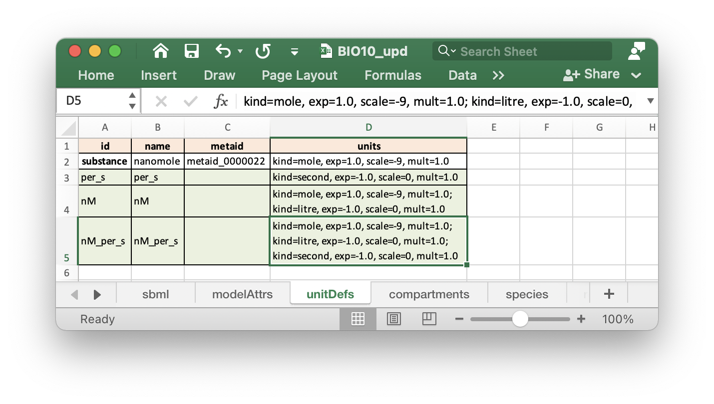
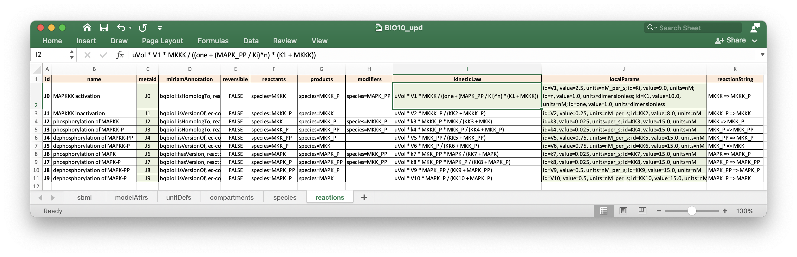
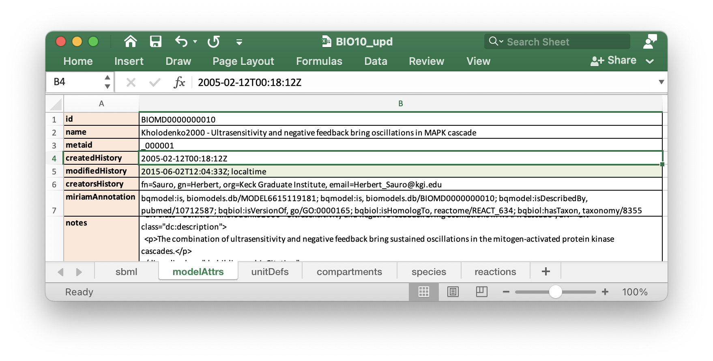
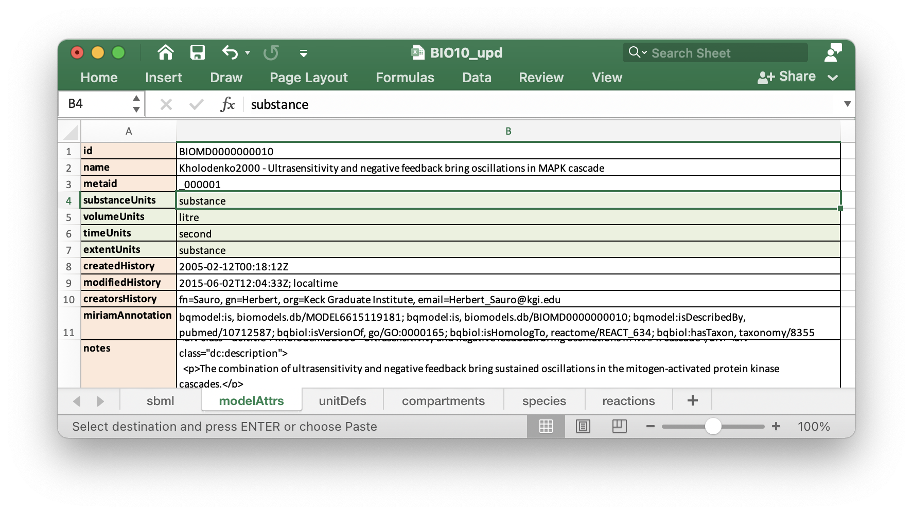
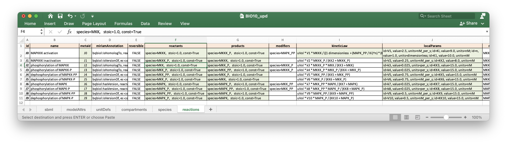
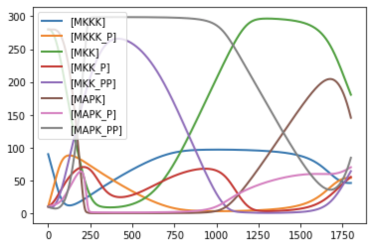
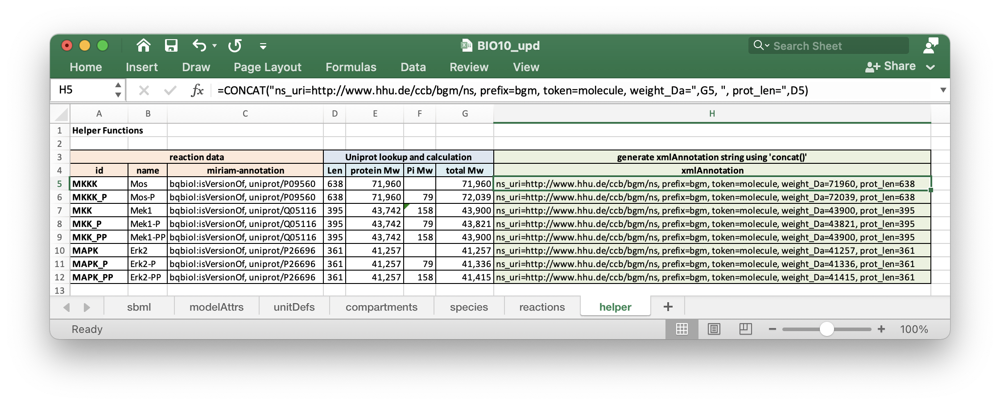
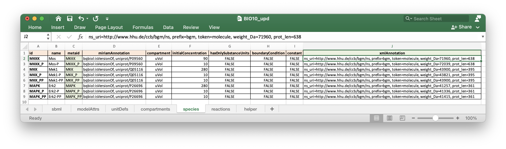

Tutorial
========

This tutorial provides a workflow for creating and modifying SBML models.
Basic Python knowledge is required. Modelers without programming experience
could use command line scrips to convert SBML to spreadsheet and spreadsheet
back to SBML, for this please check :doc:`/scripts`.

1. Convert SBML model to spreadsheet
------------------------------------

As an example, download from BioModels database the SBML model
`BIOMD0000000010_url.xml <https://www.ebi.ac.uk/biomodels/BIOMD000000001\0#Files>`_.
This is a kinetic SBML model based on a scientific publication from
Kholodenko [MAPK]_.

Assuming the model is in the directory where you execute
you Python code. This SBML model can be converted to a spreadsheet
document as follows:

.. code-block:: python

   import sbmlxdf

   model = sbmlxdf.Model('BIOMD0000000010_url.xml')
   model.to_excel('BIOMD0000000010_ulr.xlsx')

You may now open the spreadsheet document. It will contain 5 sheets.

- **sbml**
- **modelAttrs**
- **unitDefs**
- **compartments**
- **species**
- **reactions**

.. Note::

   Number of sheets and their names in the spreadsheet document
   depend on the type of components stored in the model.

E.g. sheet **sbml** contains level and version of the SBML document, in this
case Level 2 version 4.

   reaction sheet (column names are highlighted)

The **reaction** sheet contains all information related to reactions this model:

- **id**: identifier of the reaction
- **name**: a more human readable name
- **metaid**: required for miriam-annotations and model history
- **miriam-annotation**: records (";" - separated) with qualifier elements and
  resources ('http://identifiers.org/' removed)
- **reversible**: boolean value for reaction reversibility
- **reactants**: reactants of the reaction (";" - separated)
- **products**
- **modifiers**
- **kineticLaw**
- **local parameters**: parameters used in a kinetic law can be either local
  or global

.. note::

   SBML kinetics are change of **amount per time unit** and not change of
   concentration per time unit. In the kinetic laws you usually will
   pre-multiply the 'traditional' kinetic law with the compartment volume.

.. note::

    Number of columns in a sheet depend on the type of attributes used
    in the model. There are optional and mandatory attributes. Column order
    does not matter, with the exception of the ``id`` column which must
    be the first in most of the sheets (``id`` it is used as an index).

2. Spreadsheet to SBML model
----------------------------

Continuing from above example, copy the spreadsheet and name it
``BIO10_upd.xlsx``. We are not changing anything in the model for now. We
just check how to convert a spreadsheet to SBML. We also verify that no
information gets lost during transfer and none of the attribute values change.

We convert the spreadsheet to SBML with following commands:

.. code-block:: python

   upd_model = sbmlxdf.Model('BIO10_upd.xlsx')
   upd_model.export_sbml('BIO10_upd.xml')

``BIO10_upd.xml`` should now be identical to the original SBML model
``BIOMD0000000010_url.xml``, at least it should contain the same information.

.. note::

   Original and newly created SBML files are not exactly identical.
   sbmlxdf inserts a XML-comment with sbmlxdf creation time,
   libsbml version used and the model creation time.
   Sequence of XML elements and XML attributes might change.

To check if ``BIO10_upd.xml`` in fact contains all the information of the original
model, we can convert it back to spreadsheet and compare it with the
spreadsheet of the original model ``BIOMD0000000010_url.xlsx``.

.. code-block:: python

   model = sbmlxdf.Model('BIO10_upd.xml')
   model.export_sbml('BIO10_upd.xls')

Comparing ``BIOMD0000000010_url.xlsx`` with ``BIO10_upd.xlsx`` confirms,
that no information got lost in the transfer from spreadsheet to SBML and back
to spreadsheet.

3. Checking compliance with SBML specifications
-----------------------------------------------

Continuing from above. Though we successfully created a SBML model from
a spreadsheet document, we have not checked if this model actually complies fully
to SBML specifications. To improve model quality, it is recommended to first
validate the model and only after successful validation create the SBML file.

**libSBML**, the API used in the background to access SBML data structures,
contains methods for checking compliance to SBML standards. These validation
routines are invoked with the method ``validate_sbml()``. This method
creates an error report (``tmp.txt``) and a SBML file (``tmp.xml``), both in
directory ``./results``

.. code-block:: python

   upd_model = sbmlxdf.Model('BIO10_upd.xlsx')
   upd_model.validate_sbml('tmp.xml')
   {'Warnings': 10}

10 warnings are reported. Now open ``./results/tmp.txt`` with a text editor.

first few lines of ``./results/tmp.txt``::

  {'Warnings': 10} OK: SBML compliant
  line 233: (99505 [Warning]) In situations where a mathematical expression
  contains literal numbers or parameters whose units have not been declared,
  is not possible to verify accurately the consistency of the units in the
  expression.
  The units of the <kineticLaw> <math> expression 'uVol * V1 * MKKK / ((1 +
  pow(MAPK_PP / Ki, n)) * (K1 + MKKK))' cannot be fully checked. Unit
  consistency reported as either no errors or further unit errors related to
  this object may not be accurate.

  line 294: (99505 [Warning]) In situations where a mathematical expression
  contains literal numbers or parameters whose units have not been declared,
  it is not possible to verify accurately the consistency of the units in the
  expression.
  The units of the <kineticLaw> <math> expression 'uVol * V2 * MKKK_P /
  (KK2 + MKKK_P)' cannot be fully checked. Unit consistency reported as either
  no errors or further unit errors related to this object may not be accurate.

  line 345: (99505 [Warning]) In situations where a mathematical expression
  contains literal numbers or parameters whose units have not been declared,
  it is not possible to verify accurately the consistency of the units in the
  expression.

These 10 warnings are all related to consistency of units of measurement.
Line numbers in the report refer to related SBML document './results/tmp.xml'.

While warnings are not critical and the SBML model could still be created,
here we try correcting the issues in the spreadsheet ``BIO10_upd.xlsx`` and
create a SBML model which passes the validation step, i.e. having correct
units of measurement.

4. Model Update
---------------

Continuing from above we'll correct the warning messages in the spreadsheet
document ``BIO10_upd.xlsx``. Also note that the SBML version is still at
Level 2 Version 4. Updates required for higher SBML versions would be more.

From the scientific paper [MAPK]_ we know that Michaelis constants are in the
range of nanomolar (nM).

Let us try to introduce units into the model and also some other smaller
modifications. This is actually an interactive step for the modeler. He will
update the spreadsheet, import the spreadsheet with SBML and validate the model.
In case of Warnings or Errors, further correction is required.

Finally following updates to the model remove any of the warning messages:

Additional unit definitions ``per_s``, ``nM``, ``nM_per_s`` in sheet ``unitDefs``
(highlighted in green). ``metaid`` values were not specified as not required.

Updates to model reactions. We had to implement several configurations
(updates in green).

- Add unit definitions (which we defined in ``unitsDef`` sheet)
  to all parameters in ``localParams``. Unitless parameters,
  e.g. ``n`` get ``dimensionless`` assigned.
- ``kineticLaw`` for reaction ``J0`` had a unitless ``1`` in the formula.
  We introduced a local parameter ``one``, which has the unit ``dimensionless``
  assigned. Note: SBML L3V2 supports ``1 dimensionless`` in the formula.
- We also modified the cryptic ``metaids``. This is not to correct any of the
  warnings. It rather demonstrates how we can change attributes to our liking.

In the sheet ``modelAttrs`` we could add the **current time** to the
modification history. We do this by adding ``; localtime`` to the end of the
``modified-history`` value.

As there are no longer warnings, we can write out the model to SBML. Let's give
it the name ``BIO10_L2V4_with_units.xml``

.. code-block:: python

   upd_model = sbmlxdf.Model('BIO10_upd.xlsx')
   upd_model.validate_sbml('tmp.xml')
   {}
   upd_model = sbmlxdf.Model('BIO10_L2V4_with_units.xml')

5. SBML model in latest SBML version
------------------------------------

Continuing from above it is a small step to convert our model to the
latest version of SBML, currently Level 3 version 2.

We just slightly update our spreadsheet ``BIO10_upd.xlsx``, which is still in
Level 2 version 4.

First we have to change ``level`` and ``version`` in sheet ``sbml``.

Validation check after this changes will show 30 warnings. Try it.

To get rid of these warnings, we have to add following attributes to sheet
``modelAttrs``:

- **substanceUnits**
- **volumeUnits**
- **timeUnits**
- **extentUnits**

In sheet ``reactions`` we should add ``stoic`` and ``const`` attributes
to ``reactants`` and ``products``. ``constant`` is a mandatory attribute in
SBML L3V2.
With SBML L3V2 we also could change back the kinetics of reaction ``J0``, i.e.
inserting ``1 dimensionless`` into the ``kineticLaw``.

Now we can generate from out spreadsheet a SBML L3V2 compliant model.

.. code-block:: python

   upd_model = sbmlxdf.Model('BIO10_upd.xlsx')
   upd_model.validate_sbml('tmp.xml')
   {}
   upd_model = sbmlxdf.Model('BIO10_L3V2_with_units.xml')

6. Python access to SBML model data
-----------------------------------

Continuing from above we have generated from the SBML Biomodel
``BIOMD0000000010_url.xml`` an updated SBML model in Level 3 Version 2 with
units of measurement added, ``BIO10_L3V2_with_units.xml``.

Python programmers might require access to SBML data. Going through the pains
of interacting directly with **libsbml** can be avoided. sbmlxdf provides
access to SBML model data on the level of pandas dataframes.
You can extract SBML components and attributes, e.g. for use
in your optimization code. ``kineticLaws`` and other mathematical
constructs can be converted to Python functions, e.g. for ODE analysis.

To access SBML data, import a model and convert it to a set of dataframes:

.. code-block:: python

    model = sbmlxdf.Model('BIO10_L3V2_with_units.xml')
    model_df = model.to_df()
    print(model_df.keys())

    dict_keys(['sbml', 'modelAttrs', 'unitDefs', 'compartments', 'species',
    'reactions'])

Function ``sbmlxdf.extract_records()`` can be used to extract individual
records, e.g. there can be several reactants in a reaction.
Function ``sbmlxdf.extract_params()`` can be used to extract a dictionary of
key-value pairs from a record, e.g. to get all attributes of a reactant.

.. code-block:: python

    df_r = model_df['reactions']
    print(len(df_r), 'reactions found, first reaction:' )
    print(df_r.iloc[0])
    print('\nreactants and products for some reactions:')
    for id, reaction in df_r.head(3).iterrows():
        print('reaction:', id)
        for record in sbmlxdf.extract_records(reaction['reactants']):
            print('  reactant: ', sbmlxdf.extract_params(record))
        for record in sbmlxdf.extract_records(reaction['products']):
            print('  product:  ', sbmlxdf.extract_params(record))

    10 reactions found, first reaction:
    name                                                 MAPKKK activation
    metaid                                                              J0
    miriam-annotation    bqbiol:isHomologTo, reactome/REACT_525; bqbiol...
    reversible                                                       False
    reactants                          species=MKKK, stoic=1.0, const=True
    products                         species=MKKK_P, stoic=1.0, const=True
    modifiers                                              species=MAPK_PP
    kineticLaw           uVol * V1 * MKKK / ((1 dimensionless + (MAPK_P...
    localParams          id=V1, value=2.5, units=nM_per_s; id=Ki, value...
    Name: J0, dtype: object

    reactants and products for some reactions:
    reaction: J0
      reactant:  {'species': 'MKKK', 'stoic': '1.0', 'const': 'True'}
      product:   {'species': 'MKKK_P', 'stoic': '1.0', 'const': 'True'}
    reaction: J1
      reactant:  {'species': 'MKKK_P', 'stoic': '1.0', 'const': 'True'}
      product:   {'species': 'MKKK', 'stoic': '1.0', 'const': 'True'}
    reaction: J2
      reactant:  {'species': 'MKK', 'stoic': '1.0', 'const': 'True'}
      product:   {'species': 'MKK_P', 'stoic': '1.0', 'const': 'True'}

It is also possible to retrieve the stoichiometric matrix using:

.. code-block:: python

   print(model.get_s_matrix())

             J0   J1   J2   J3   J4   J5   J6   J7   J8   J9
   MKKK    -1.0  1.0  0.0  0.0  0.0  0.0  0.0  0.0  0.0  0.0
   MKKK_P   1.0 -1.0  0.0  0.0  0.0  0.0  0.0  0.0  0.0  0.0
   MKK      0.0  0.0 -1.0  0.0  0.0  1.0  0.0  0.0  0.0  0.0
   MKK_P    0.0  0.0  1.0 -1.0  1.0 -1.0  0.0  0.0  0.0  0.0
   MKK_PP   0.0  0.0  0.0  1.0 -1.0  0.0  0.0  0.0  0.0  0.0
   MAPK     0.0  0.0  0.0  0.0  0.0  0.0 -1.0  0.0  0.0  1.0
   MAPK_P   0.0  0.0  0.0  0.0  0.0  0.0  1.0 -1.0  1.0 -1.0
   MAPK_PP  0.0  0.0  0.0  0.0  0.0  0.0  0.0  1.0 -1.0  0.0

7. Run time course analysis
------------------------------------------

Once we have a SBML model, we might want to run a time course
analysis to see the change of concentrations over time.
Let us use the SBML model 'BIO10_L3V2_with_units.xml'.

I'll present two methods for time course analysis.
Users without Python programming experience can use the graphical tool
`COPASI <copasi.org>`_. Alternatively, you can use the Python package
`tellurium  <http://tellurium.analogmachine.org>`_, but this requires
some coding.

7.1 Time course analysis in COPASI
~~~~~~~~~~~~~~~~~~~~~~~~~~~~~~~~~~

Assuming you already installed **COPASI** on your system. The example below
is based on COPASI 4.33 (Build 246).

These are the steps for generating a time course plot:

- open **COPASI** application
- import the SBML model via menu ``File -> Import SBML ...``,
  select SBML file ``BIO10_L3V2_with_units.xml``.
  In my system a warning messages comes up, informing me that *length unit* and
  *area unit* are not defined. Don't worry, these units are not used
  in our model.

  COPASI converts the SBML model into its internal format.

  .. image:: ./images/copasi_model.png

- create a plot:
  ``COPASI -> Output Specifications -> Plots[0]``.
  Add a ``New`` plot and add a ``New Curve``,
  select for ``X-Axis`` ``Time -> Model Time``,
  select for ``Y-Axis`` ``Species -> Transient Concentrations`` and confirm.

  .. image:: ./images/copasi_plot_definition.png

- preform time course analysis:
  ``COPASI -> Tasks -> Time Course``
  Set ``Duration [s]`` to ``1800`` and ``Intervals`` to ``1000``.
  Press ``Run``

  .. image:: ./images/copasi_timecourse.png

- a plot showing the concentrations over time should appear. It not, the plot
  window might be hidden by other windows.

  .. image:: ./images/copasi_plot_result.png

7.2 Time course in tellurium
~~~~~~~~~~~~~~~~~~~~~~~~~~~~

Assuming you already pip installed the tellurium package.

.. code-block:: python

  import tellurium as te

  r = te.loadSBMLModel('BIO10_L3V2_with_units.xml')
  r.simulate(0, 1800, 1000)
  r.plot()

8. Adding application specific annotations
------------------------------------------

As an implementer of optimization methods you might require application
specific attributes on SBML components. This can be done using the annotation
mechanism provided by SBML.

Continuing from the model above, we might be interested in the molecular
weight of the species involved in the reactions and possibly the length of the
proteins. We might required these attributes to configure additional
constraints during optimization. We could add this information as SBML
parameters to the ``parameters`` sheet (not discussed yet).
However, we would have difficulties linking ``species``
objects with corresponding ``parameters`` object.

Using the annotation mechanism we can directly add our required attributes
on the level of ``species``. Let us extend our spreadsheet ``BIO10_upd.xlsx``.

To benefit from spreadsheet features, we
add a sheet ``helpers`` and copy relevant information from the
``species`` sheet. The ``miriam-annotation`` values provide references
to ``UniProt`` database. We manually lookup
`UniProt <https://www.uniprot.org>`_ and search for the **unitprot ids** used
in our model. In the **Sequence** section we find protein length and
molecular weight, which we add to our table.
Just as an example, we also add weights of inorganic phosphates.
Using Excel ``concat()`` function we create ``xml-annotations``
using fixed namespace, token and prefix and
variable values from our table. Note: Here I define an arbitrary namespace.

Subsequently we **copy** the ``xml-annotation`` column and
**Paste Special - Values** it into our ``species`` sheet.
I also updated the ``metaid`` values.

We import the spreadsheet, validate it and create our new SBML
``BIO10_L3V2_with_XML_annot.xml``.

.. code-block:: python

    upd_model = sbmlxdf.Model('BIO10_upd.xlsx')
    upd_model.validate_sbml('tmp.xml')
    {}
    upd_model.export_sbml('BIO10_L3V2_with_XML_annot.xml')

As a Python programmer you now have access to the additional attributes,
which is demonstrated in below code block:

.. code-block:: python

  model = sbmlxdf.Model('BIO10_L3V2_with_XML_annot.xml')
  model_df = model.to_df()
  df_s = model_df['species']
  for species, row in df_s.iterrows():
      attrs = sbmlxdf.misc.extract_xml_attrs(row['xml-annotation'], token='molecule')
      print(species, attrs)

  MKKK {'weight_Da': '71960', 'prot_len': '638'}
  MKKK_P {'weight_Da': '72039', 'prot_len': '638'}
  MKK {'weight_Da': '43900', 'prot_len': '395'}
  MKK_P {'weight_Da': '43821', 'prot_len': '395'}
  MKK_PP {'weight_Da': '43900', 'prot_len': '395'}
  MAPK {'weight_Da': '41257', 'prot_len': '361'}
  MAPK_P {'weight_Da': '41336', 'prot_len': '361'}
  MAPK_PP {'weight_Da': '41415', 'prot_len': '361'}
